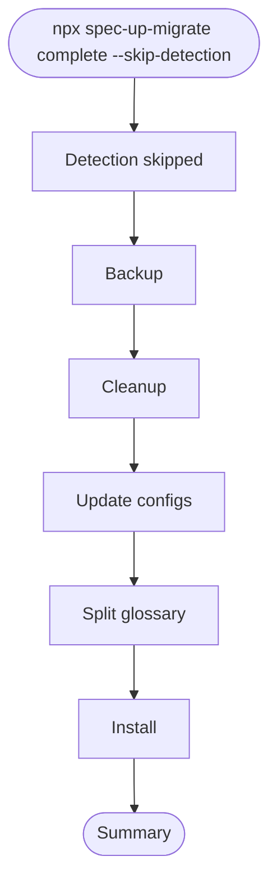

# Developer Info: "complete --skip-detection" flow

This document explains what happens when running:

- npx spec-up-migrate complete --skip-detection

It summarizes the control flow, which modules are involved, which files are created or modified, where external boilerplate files come from, and the overwrite rules. It also includes a simple flow chart.

**Note:** As of v1.2.1, the detection logic has been significantly improved. The `--skip-detection` flag should rarely be needed for standard projects. It remains available for:
- Testing and debugging
- Highly customized project structures
- CI/CD pipelines with pre-verified projects
- Emergency bypasses

## Improved Detection (v1.2.1+)

The detection system now:
- Recognizes `spec-up` OR `spec-up-t` dependencies
- Detects spec-up-style scripts (render, edit, dev)
- Identifies the spec-up tool itself (markdown-it + gulp)
- Recognizes already-migrated projects
- Uses a 70% confidence threshold (down from 80%)
- Gives less weight to optional files (index.js, gulpfile.js)

This means most valid Spec-Up projects will now pass detection without needing `--skip-detection`.

## High-level flow

Entrypoint: `bin/cli.js`

- Command `complete` calls `completeMigration()` from `lib/migrator.js`.

Sequence in `completeMigration(directory, { dryRun, skipBackup, skipDetection })`:

1. Detection (skipped due to `--skip-detection`): Tool assumes a valid Spec‑Up project. A synthetic “Detection” phase entry is recorded as skipped.
1. Backup (unless `--no-backup`): `lib/backup.js` copies “critical files” and folders to sibling backup names.
1. Cleanup: `lib/cleanup.js` removes obsolete Spec‑Up files/dirs (assets, src, gulpfile.js, etc.).
1. Update configurations: `lib/updater.js` updates/creates `package.json`, `specs.json`, `.gitignore`, required directories, root/spec files, and fetches optional `.github/workflows/*` from the boilerplate repo.
1. Split glossary (optional): `lib/splitter.js` attempts to split glossary into term files if it’s safe; if it fails, migration continues.
1. Install: `lib/installer.js` installs dependencies (npm install) unless skipped internally, ensures `.env.example`, and creates a sample spec file when needed.

## Mermaid chart

## Modules that implement the phases

- CLI wiring: `bin/cli.js`
- Orchestrator: `lib/migrator.js`
- Detection: `lib/detector.js` (skipped with `--skip-detection`)
- Backup: `lib/backup.js`
- Cleanup: `lib/cleanup.js`
- Update configs and boilerplate fetching: `lib/updater.js`
- Splitter: `lib/splitter.js`
- Installer: `lib/installer.js`
- Utilities: `lib/utils.js`

## Files created (only if missing unless noted)

- Root
  - `package.json`
    - Created if missing; otherwise overwritten (see “Overwrite behavior”).
  - `.gitignore`
    - Created if missing; otherwise appended and cleaned.
  - `.env.example`
- Specs
  - `specs.json`
    - Created if missing from boilerplate (with fallback).
  - `spec/` (or configured spec directory from `specs.json`)
  - `spec/terms-definitions/`
  - `spec/terms-and-definitions-intro.md`
  - `spec/sample.md` (only when installer creates a spec dir from scratch)
- Assets
  - `assets/`
  - `assets/test.json`
  - `assets/test.text`
- GitHub workflows (created only if missing; never overwritten)
  - `.github/workflows/menu.yml`
  - `.github/workflows/set-gh-pages.yml`
- Splitter outputs (if split runs and safety checks pass)
  - `spec/.../glossary-intro-created-by-split-tool.md`
  - `spec/terms-definitions/*.md` (one per `[[def: ...]]`)
  - `spec/.../specification-after-glossary.md`
- Backups (if backup phase not skipped)
  - `assets-backup/`, `custom-assets-backup/`, `multi-file-test-backup/`, `single-file-test-backup/`
  - `specs-backup.json`, `package-backup.json`
  - `.gitignore-backup`, `.github-backup/`

## Files copied from external boilerplate

External boilerplate is fetched in `lib/updater.js` and written into the project if missing:

- `.github/workflows/menu.yml`
- `.github/workflows/set-gh-pages.yml`
- `specs.json` boilerplate (used when `specs.json` is missing)
- `package.json` scripts are populated from a remote config (with local fallback if fetching fails)
- `.gitignore` entries are populated from a remote baseline (with fallback if fetching fails)

## Boilerplate source URLs

Primary boilerplate repo (code and workflows)

- Web: [github.com/blockchainbird/spec-up-t](https://github.com/blockchainbird/spec-up-t)
- Raw base: `https://raw.githubusercontent.com/blockchainbird/spec-up-t/refs/heads/master/`
  - Example paths consumed by the tool:
    - `src/install-from-boilerplate/boilerplate/specs.json`
    - `src/install-from-boilerplate/boilerplate/.github/workflows/menu.yml`
    - `src/install-from-boilerplate/boilerplate/.github/workflows/set-gh-pages.yml`
    - `src/install-from-boilerplate/config-scripts-keys.js` (for scripts)
    - `src/install-from-boilerplate/boilerplate/gitignore` (for `.gitignore` entries)

Logo and favicon in fallback config (referenced URLs only)

- Web: [github.com/trustoverip/spec-up-t](https://github.com/trustoverip/spec-up-t)
- Raw base: `https://raw.githubusercontent.com/trustoverip/spec-up-t/refs/heads/master/`
  - `src/install-from-boilerplate/boilerplate/static/logo.svg`
  - `src/install-from-boilerplate/boilerplate/static/favicon.ico`

## Overwrite behavior

- `package.json`
  - If missing: created using a Spec‑Up‑T starter template and scripts (from remote config or fallback).
  - If present: reconstructed from a starter template, preserving only high‑level metadata (name, version, description, author, license, repository, keywords, homepage, bugs). Dependencies are replaced with `{ dotenv, spec-up-t }`. `devDependencies` and `main` are removed. Scripts are replaced with Spec‑Up‑T scripts. Result is written back (overwrite).
- `specs.json`
  - If missing: created from remote boilerplate (fallback if offline).
  - If present: transformed to Spec‑Up‑T format and written back (overwrite). Splitter may update it again to adjust `markdown_paths`.
- `.gitignore`
  - If missing: created with boilerplate entries (fallback if offline).
  - If present: appended with any missing boilerplate entries, and deprecated lines removed. Content is preserved otherwise.
- `.github/workflows/*`
  - Always overwrite existing files.
- Root/spec/asset files listed above
  - Created only if missing.
- Cleanup phase
  - Deletes obsolete Spec‑Up assets and build files if present.
- Backup phase
  - Creates sibling backup copies; existing backups may be overwritten on repeat runs.

## Notes

- Splitter safety checks prevent overwriting user content in `spec/terms-definitions` unless it already looks split (has `.md` files with `[[def:]]` or `[[tref:]]`).
- Update logic has network fallbacks so the CLI still produces a working Spec‑Up‑T setup offline.
- Installer creates `spec/sample.md` only when the spec directory is created fresh.
